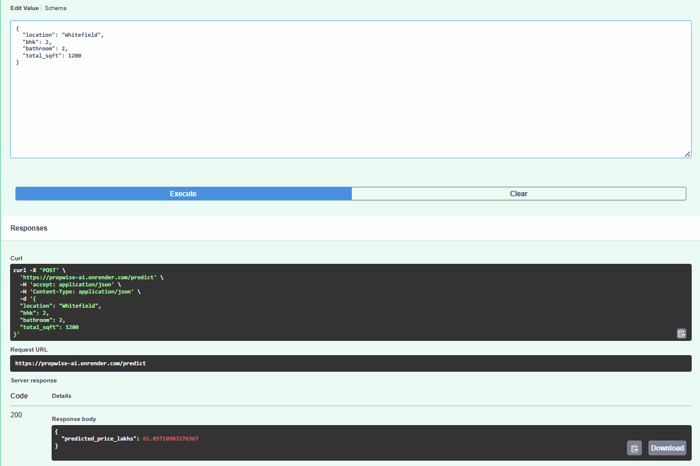
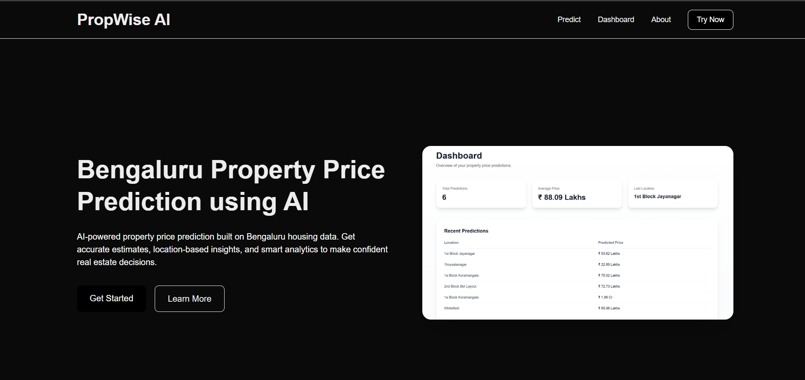
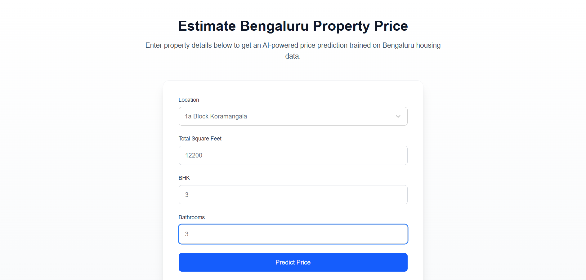

# PropWise AI 🏠

PropWise AI is a full-stack machine learning web application that predicts house prices in Bangalore using XGBoost.

**This project combines Machine Learning, FastAPI backend, and a Next.js frontend into a real-world end-to-end system.**

---

## 🔗 Live Links

Frontend (Vercel): https://propwise-ai.vercel.app/

Backend API (Render): https://propwise-ai.onrender.com/docs

---

## ✨ What this project does

You enter:

- Location
- BHK 
- Bathrooms
- Total Sqft

and PropWise AI instantly predicts the **estimated house price (in Lakhs)** using an ML model served via FastAPI.

---

## 🚀 Features

- XGBoost-based house price prediction
- Feature engineering + outlier removal
- Location one-hot encoding
- FastAPI backend REST API
- Pydantic-based backend validation
- Separate result page with analytics
- Dashboard with prediction history (localStorage)
- Real-time inference
- Loading states & form validation
- Next.js + Tailwind frontend
- End-to-end ML pipeline (Notebook → Model → API → UI)
- Backend deployed on Render
- Frontend deployed on Vercel

---

## 📊 Model Performance

- XGBoost Regressor  
- RMSE ≈ **45 Lakhs** (after feature engineering, log-transform & outlier removal)

---

## 🧠 ML Pipeline

- Raw Bangalore housing dataset
- Data cleaning + null handling
- Feature engineering
- Outlier removal
- Log transformation on target
- One-hot encoding
- XGBoost training
- Model serialization (Joblib)
- FastAPI inference
- React frontend consumption

---

## 🛠 Tech Stack

### Machine Learning
- Python
- Pandas / NumPy
- Scikit-learn
- XGBoost

### Backend
- FastAPI
- Joblib
- Pydantic
- Render Deployment

### Frontend
- Next.js (React)
- Tailwind CSS
- React Select
- Vercel Deployment

### Tools
- Git & GitHub

---


## ▶ How to run locally

### Clone the repo and move inside folder:
```bash
git clone https://github.com/Himanshimittal051104/PropWise_AI.git
cd PropWise_AI
```

### Start Backend

Go to backend folder:
```bash
cd backend
```

Create virtual environment (optional but recommended):
```bash
python -m venv venv
```


Activate it:
**Windows**
```bash
venv\Scripts\activate
```
**Mac/Linux**
```bash
source venv/bin/activate
```

Install dependencies:
```bash
pip install -r requirements.txt
```

Start backend server:
```bash
uvicorn app.main:app --reload
```

Backend will run at:
```text
http://127.0.0.1:8000
```

### Start Frontend

Install packages:
```bash
npm install
```

Start frontend:
```bash
npm run dev
```

Open in browser:
```text
http://localhost:3000
```

---

## 🌐 Deployment 

### Backend (Render)

FastAPI backend is deployed on Render with GitHub auto-deploy enabled.

Live API:
```bash
https://propwise-ai.onrender.com/docs
```

Features:

- Live REST API
- Input validation using Pydantic
- Unknown locations mapped to `other`
- Log-transformed target with inverse inference
- Minimum price safeguard

### Frontend (Vercel)

Next.js frontend deployed on Vercel.

Connected to backend using environment variable:
```bash
NEXT_PUBLIC_API_URL=https://propwise-ai.onrender.com
```

---

## 🧪 Backend API Demo

FastAPI Swagger UI showing live prediction endpoint:



---

## 📸 Screenshots





---

## 📥 Sample API Request
```json
{
  "location": "Whitefield",
  "bhk": 2,
  "bathroom": 2,
  "total_sqft": 1200
}
```

---

## 📤 Sample API Response
```json
{
  "predicted_price_lakhs": 78.4
}
```

---

## 📌 Why I built this

This project helped me understand:

- Deploying ML models to production
- FastAPI backend development
- React + Next.js integration
- Real-world form handling
- API communication
- Dashboard analytics
- Full-stack deployment workflow

---

## 🔮 Future Improvements

- Charts for price trends
- Multi-city support
- Authentication
- Improved UI animations
- Error messaging
- Database integration

---

## 👩‍💻 Author

Himanshi Mittal

---


